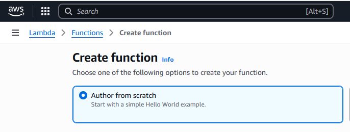
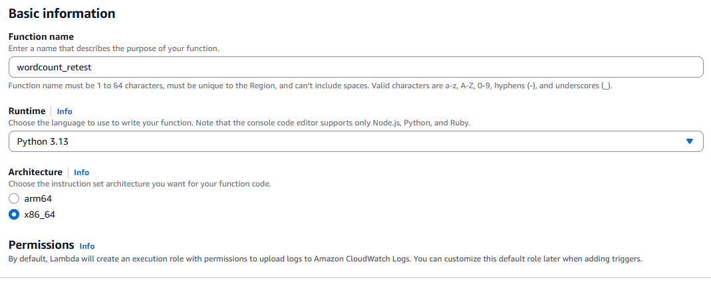
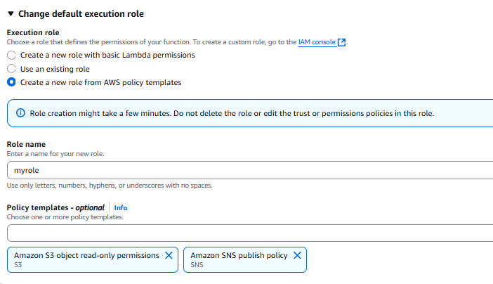
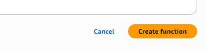
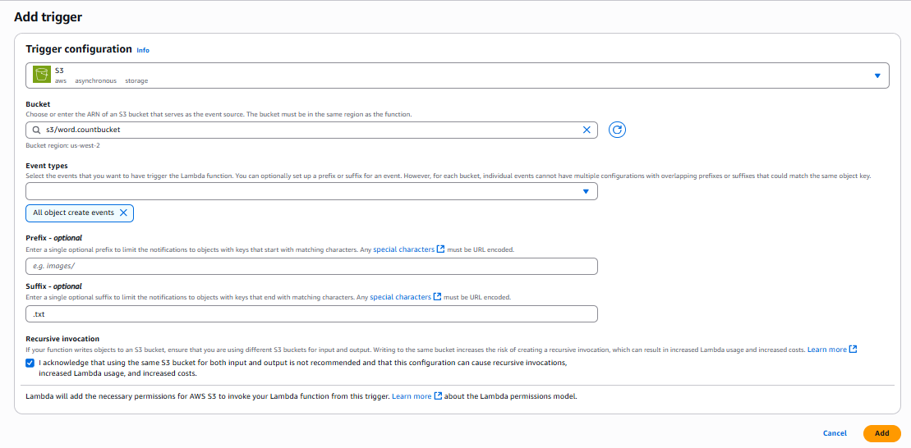
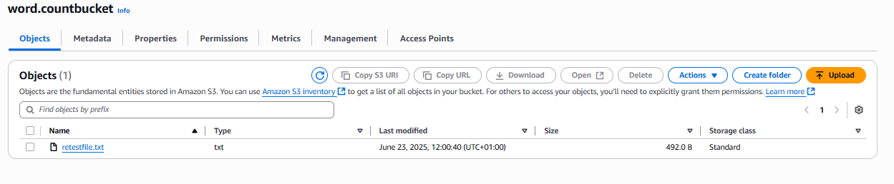
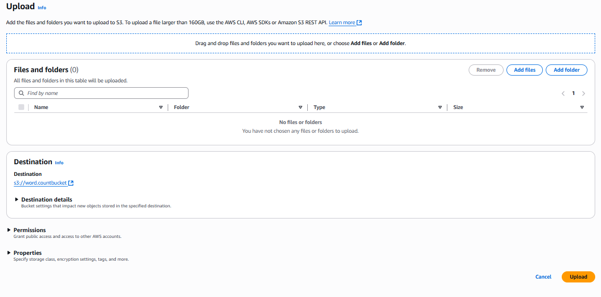

# Word Count Lambda Function

This project contains an AWS Lambda function that counts the number of words in a text file uploaded to an S3 bucket. The word count result is then sent via email using Amazon SNS.

## Project Structure

```
lambda-word-count
├── src
│   ├── lambda_function.py       # Main Lambda function triggered by S3 events
│   └── utils
│       └── word_counter.py       # Utility function to count words
├── requirements.txt              # Project dependencies
├── event.json                    # Sample event for local testing
└── README.md                     # Project documentation
```

## Setup Instructions

1. **Create an S3 Bucket**: Set up an S3 bucket in your AWS account where you will upload text files.

bucketname: lambdaprject25

2. **Create an SNS Topic**: Create an SNS topic to which the Lambda function will publish the word count results. Subscribe your email address (and optionally a phone number for SMS) to this topic.

3. **Deploy the Lambda Function**:
   - Go to the AWS Lambda console.
   - Create a new Lambda function.
   
   - Set the runtime to Python 3.x.
   
   - Upload the code from the `src` directory.
   - Set the necessary permissions for the Lambda function to access S3 and SNS.
   


- Press create function


4. **Configure S3 Trigger**: Set up an S3 trigger for the Lambda function so that it is invoked whenever a new text file is uploaded to the specified S3 bucket.
 
 Add the following text into the file 
 
      

## Usage

- Upload a text file to the configured S3 bucket.
- The Lambda function will automatically trigger, count the words in the file, and send the result to the specified SNS topic.





## Notes

- Ensure that your Lambda function has the appropriate IAM role with permissions to access S3 and publish to SNS.
- Monitor the Lambda function's logs in CloudWatch for debugging and verification of the word count results.

Outcome
===================================================
You should get an email, with the 

Title: Word Count 
Result: The text count.


Setup your GIT space
==================================================

…or push an existing repository from the command line
git remote add origin https://github.com/johnlekex/lambda-word-count.git
git branch -M main
git push -u origin main


…or create a new repository on the command line
echo "# lambda-word-count" >> README.md
git init
git add .
git commit -m "first commit"
git branch -M main


git add .
git commit -m "first commit"
git push -u origin main